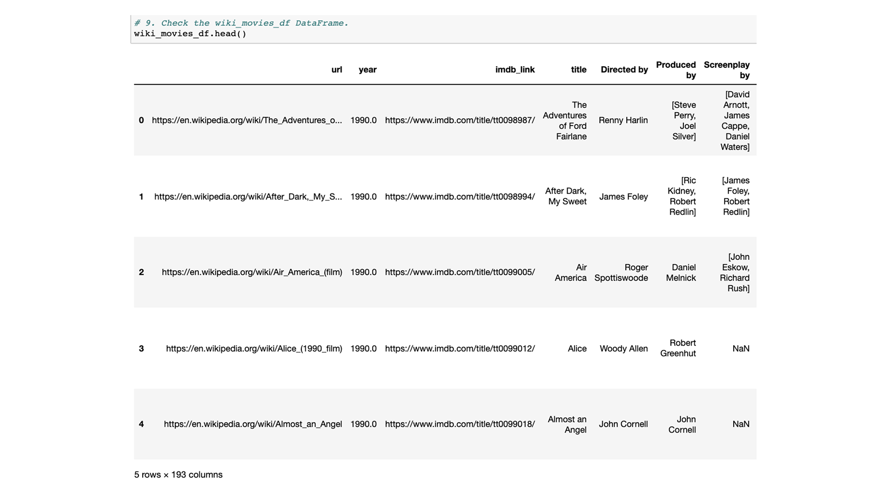
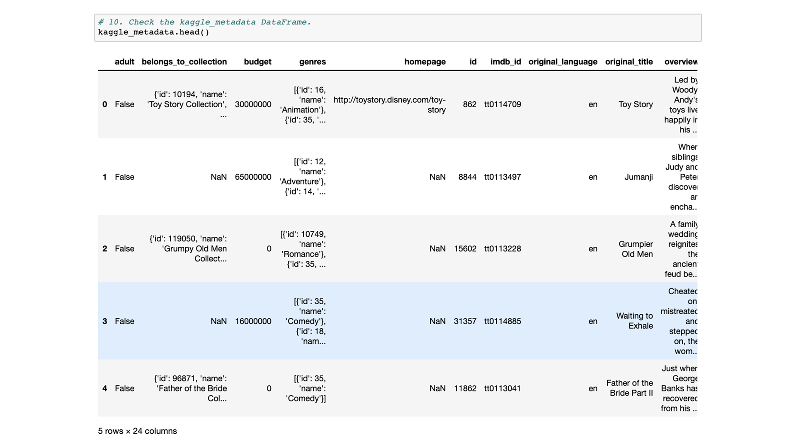
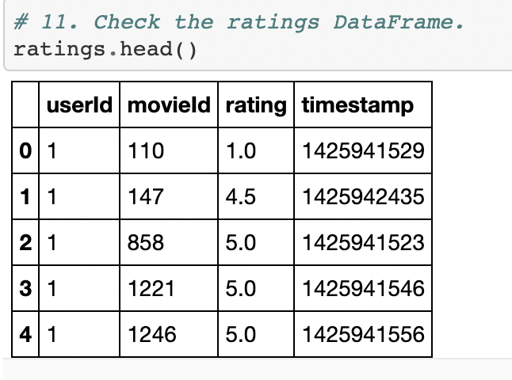
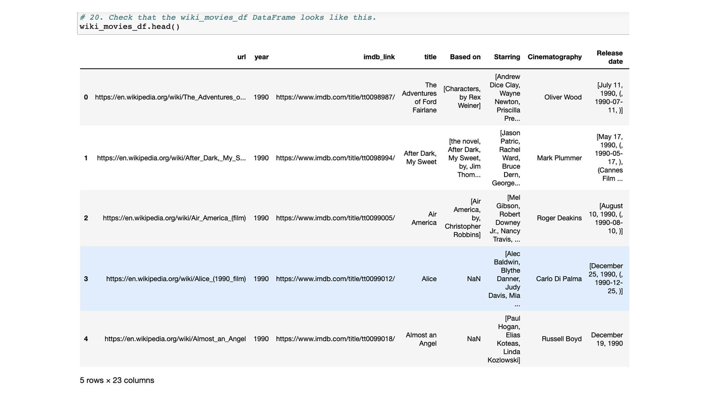
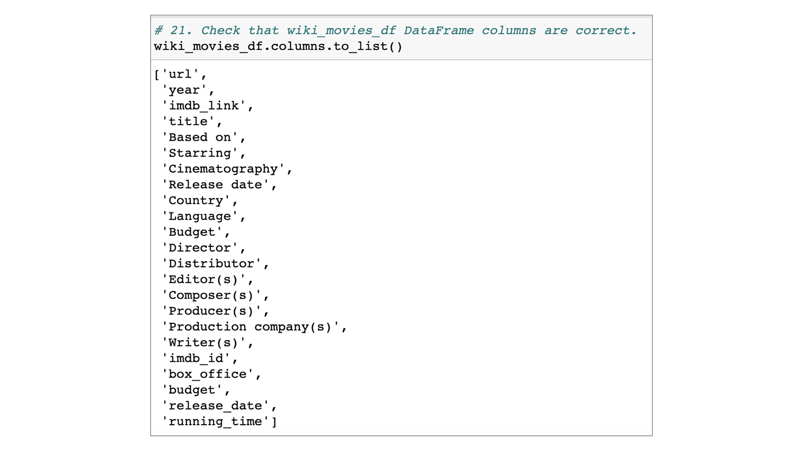
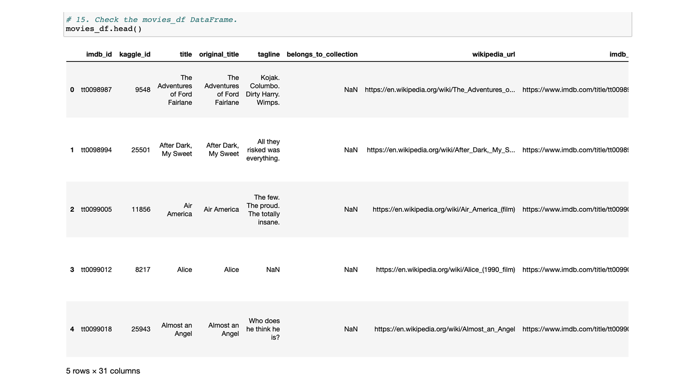
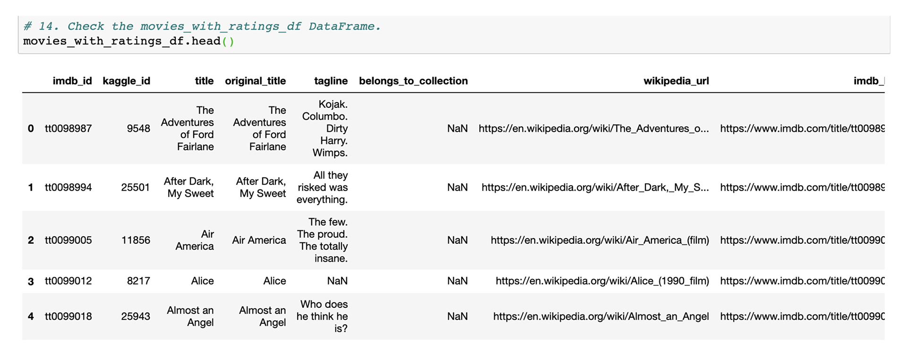
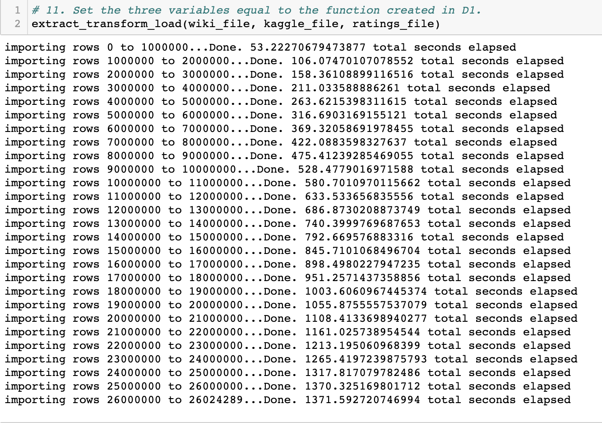
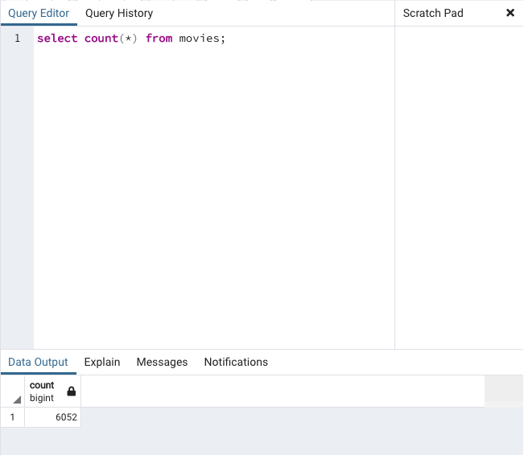
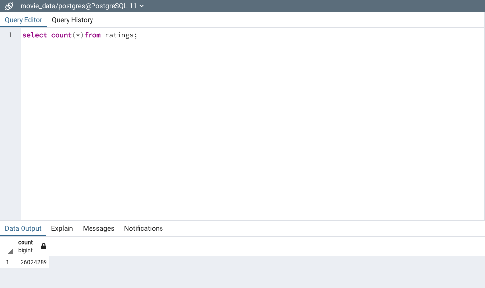

## Movies-ETL
Amazing Prime loves the dataset and wants to keep it updated on a daily basis. The purpose of the analysis is to clean and merge data using ETL process. Britta needs help to create an automated pipeline that takes in new data, performs the appropriate transformations, and loads the data into existing tables. Module Code needs to be refactored by creating a function that takes three files:

- ### Wikipedia
- ### Kaggle Metadata
- ### MovieLens Rating Data 

All the three above files will perform Extract, Transfer and load process (ETL) by adding the data to a PostgreSQL Database. 

## Results:
### Deliverable 1: ETL Function to Read Three Data Files

### Deliverable 2: Extract and Transform the Wikipedia Data

### Deliverable 3: Extract and Transform the Kaggle data

### Deliverable 4: Create the Movie Database

## Summary:
After completing the extract, transform, and load process, I had a database with two tables: one for movies and one for ratings.
- The movie data from Wikipedia and Kaggle from their respective files, transform the datasets by cleaning them and merging them together, then load the cleaned dataset into a SQL database.The "movies" table contains 6,052 rows based on the kaggle and wikipedia data. 

- The "ratings" table includes 26,024,289 rows of data.

